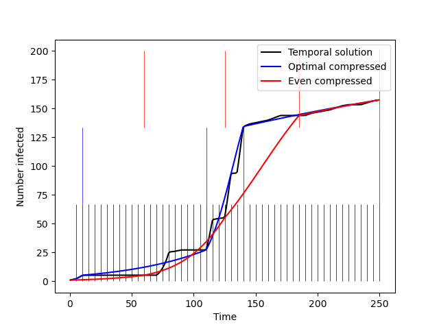

# compressnets

To use `compressnets`, install the package via the PyPi (or TestPyPi) index via
`pip install -i https://test.pypi.org/simple/ compressnets`.

## Most basic usage
The core elements of `compressnets` are the objects, `network.TemporalNetwork` and `network.Snapshot`,
and the algorithm `compression.Compressor.compress(...)`.

As an example, create a NumPy array to represent your adjacency matrices:
```
snapshot_1 = [[0, 0, 1],
            [0, 0, 1],
            [1, 1, 0]]
snapshot_2 = [[0, 1, 1],
            [1, 0, 1],
            [1, 1, 0]]
snapshot_3 = [[0, 1, 0],
            [1, 0, 1],
            [0, 1, 0]]
```
Then create a list of `Snapshot` objects from your arrays, equipped with a consecutive start and end time for each:
```
infect_rate = 0.5
snapshots = [network.Snapshot(start_time=0, end_time=1, beta=infect_rate, A=snapshot_1),
             network.Snapshot(start_time=1, end_time=2, beta=infect_rate, A=snapshot_2),
             network.Snapshot(start_time=2, end_time=3, beta=infect_rate, A=snapshot_3)]
```
Then create a `TemporalNetwork` object to contain all of your ordered snapshots:
```
your_temporal_network = network.TemporalNetwork(snapshots)
```
Using the algorithmic compression from our paper [link], you can compress
the temporal network into a desired number of compressed snapshots (in this example, 5), by calling on an instance of the static `Compressor` class
```
your_compressed_network_result = compression.Compressor.compress(your_temporal_network,
                                                          compress_to=5,
                                                          how='optimal')
``` 
which will return the new `TemporalNetwork` object, and also the total induced error from the snapshots that
were selected for compression. The elements can be accessed via a dictionary as
```
your_compressed_network = your_compressed_network_result["compressed_network"]
total_induced_error = your_compressed_network_result["error"]
```
To compress your original network into an even division and aggregation of snapshots,
not using our algorithm, you can call `compress` and changing the `how` argument to `even`:
```
your_even_compressed_network_result = compression.Compressor.compress(your_temporal_network,
                                                          compress_to=5,
                                                          how='even')
even_compressed_network = your_even_compressed_network_result["compressed_network"]                                                    
``` 

From the resulting compressed `TemporalNetwork` objects, you can now access your snapshots as you
would with your original temporal network, by accessing the `snapshots` member via
```
your_new_snapshots = your_compressed_network.snapshots
```
from which you can access each snapshot's new duration, adjacency matrix, start and end times.

## Usage using demo network

For a more involved demo, make use of the `compressnets.demos` module to access a more complex
temporal network without having to create one yourself. Follow the code below in your
own workspace to use a sample temporal network to compress it, and visualize a system of ODEs over
the compressed network vs. the original temporal solution. 

```
demo_network = demos.Sample.get_sample_temporal_network()
compressed_optimal = comp.Compressor.compress(my_net, compress_to=4, how='optimal')["compressed_network"]
compressed_even = comp.Compressor.compress(my_net, compress_to=4, how='even')["compressed_network"]
```
Now you have the resulting compressed temporal networks for the optimal (algorithmic) method and from an even
aggregation method. 

To visualize the new time boundaries of each aggregated snapshot, and compare a full
Susceptible-Infected disease spread process against the fully temporal network, you can
utilize the `compressnets.solvers` module to solve a system of ODEs and plot the resulting figure:

```
## Creating and solving a model with the original temporal network

N = demo_network.snapshots[0].N
beta = demo_network.snapshots[0].beta
model = solvers.TemporalSIModel({'beta': beta}, np.array([1/N for _ in range(N)]),
                                demo_network.snapshots[demo_network.length-1].end_time,
                                demo_network)
soln = model.solve_model()
smooth_soln = model.smooth_solution(soln)
plt.plot(smooth_soln[0], smooth_soln[1], color='k', label='Temporal solution')
plt.vlines(list(demo_network.get_time_network_map().keys()), ymin=0, ymax=N/3, ls='-',
          lw=0.5, alpha=1.0, color='k')


## Creating and solving a model with the algorithmically compressed temporal network

N = compressed_optimal.snapshots[0].N
beta = compressed_optimal.snapshots[0].beta
model = solvers.TemporalSIModel({'beta': beta}, np.array([1/N for _ in range(N)]),
                                compressed_optimal.snapshots[compressed_optimal.length-1].end_time,
                                compressed_optimal)
soln = model.solve_model()
smooth_soln = model.smooth_solution(soln)
plt.plot(smooth_soln[0], smooth_soln[1], color='b', label='Optimal compressed')
plt.vlines(list(compressed_optimal.get_time_network_map().keys()), ymin=N/3, ymax=2*N/3, ls='-',
          lw=0.5, alpha=1.0, color='b')


## Creating and solving a model with the evenly compressed temporal network

N = compressed_even.snapshots[0].N
beta = compressed_even.snapshots[0].beta
model = solvers.TemporalSIModel({'beta': beta}, np.array([1/N for _ in range(N)]),
                                compressed_even.snapshots[compressed_even.length-1].end_time,
                                compressed_even)
soln = model.solve_model()
smooth_soln = model.smooth_solution(soln)
plt.plot(smooth_soln[0], smooth_soln[1], color='r', label='Even compressed')
plt.vlines(list(compressed_even.get_time_network_map().keys()), ymin=2*N/3, ymax=N, ls='-',
          lw=0.5, alpha=1.0, color='r')

plt.ylabel('Number infected')
plt.xlabel('Time')
plt.legend()
plt.show()
```



Output figure from the sample code above using the provided demo temporal network.
The original temporal network has 50 snapshots and is compressed down to 4 snapshots.
In blue, you see the resulting temporal boundaries of the 4 snapshots compressed using our
algorithm. In red, you see the resulting temporal boundaries of the 4 snapshots compressed
into even-size aggregate matrices. The time series represent an SI epidemic process over the
3 versions of the network.

